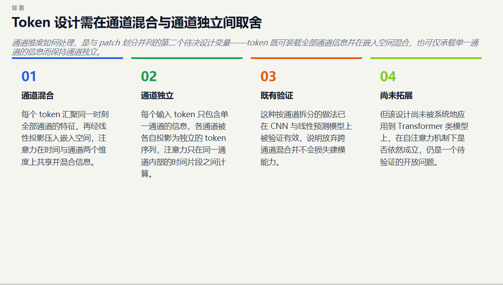
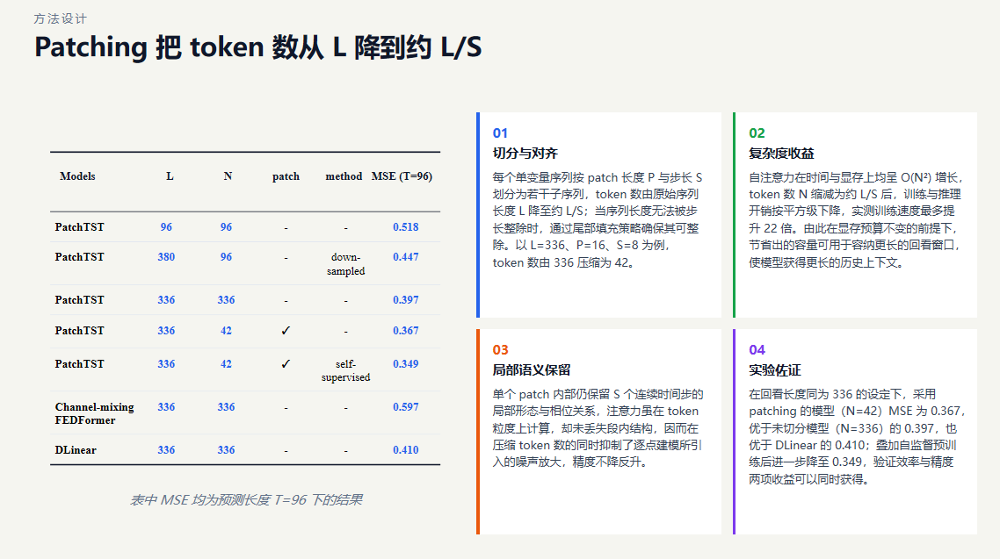
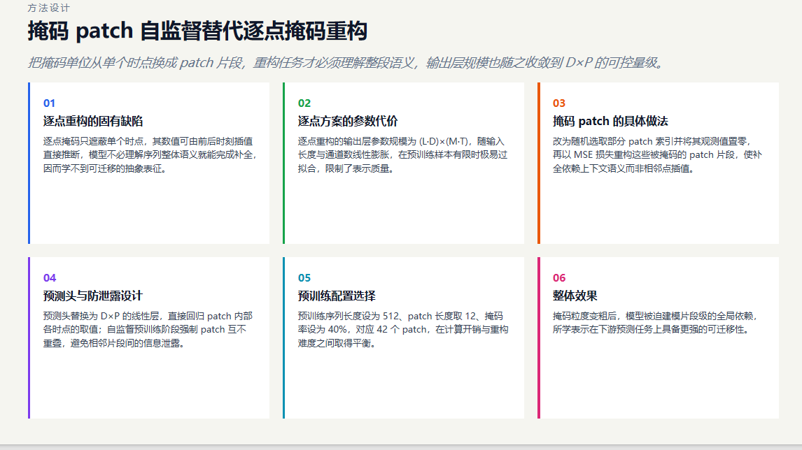

# PaperDeck
---

## 架构

```
论文 PDF
  │  Parser（解析论文：文本 / 公式 / 表格 / 图，MinerU 可选高保真）
  ▼
Planner（规划大纲：固定四大块 + 自动小标题，输出结构化 outline）
  │  Faithfulness（逐条证据核对：无依据要点剔除）
  │  Coherence（公式 / 章节一致性检查）
  ▼
Author（按模板填内容：kicker + H1 + lead + 卡片，输出 markdown 中间态）
  │  Judge（qwen 内容审查：40–400 词密度 / 书面化 / 相关性，未过自动重写）
  ▼
Renderer（md_engine → page_engine 确定性模板 → HTML，dom-to-pptx 转 PPTX）
  │
  └─ Critic 审查闭环 ────────────────────────────────┐
       layout_checker（确定性几何检查，零 token）      │
       VLM 并行看图（只查严重文字溢出，定位溢出源）      │
       Router 分发（排版→Fixer 压缩/拆点；缺数据→RAG） │
       → 重渲染 → 复查（≤2 轮）                        │
       └──────────────────────────────────────────────┘
```

## 演示效果

以下为 PaperDeck 自动生成的学术汇报 PPT 页面示例：





